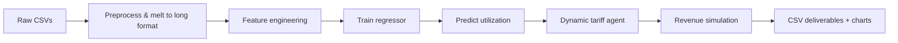

# SOC / OP_26 — Agentic AI for EV Charging Networks

## 1. Project overview

This project analyzes electric-vehicle (EV) charging demand using the **UrbanEV** dataset (Shenzhen districts) and optional **ACN** session logs. It trains a utilization forecasting model and simulates an **agentic dynamic pricing** policy that adjusts tariffs based on predicted congestion.

| Item | Detail |
|------|--------|
| Course / track | SOC Data Science — OP_26 Analytics |
| Primary data | UrbanEV (`Datasets OP_26 Analytics/UrbanEV_ SZ_districts/`) |
| Core notebooks | `main1.ipynb` (full pipeline), `deliverables.ipynb` (exports + charts) |
| Simulation output | `simulation_results.csv` |

---

## 2. Business problem

- **Peak hours (17:00–22:00)** see high utilization; flat pricing does not manage congestion or capture willingness-to-pay.
- **Off-peak** slots stay under-used; discounts can shift load and increase total sessions.
- **Goal:** Maximize network revenue while keeping utilization predictable via data-driven tariffs.

**Baseline:** flat ₹15/kWh for every session (30 kWh assumed per interval in simulation).

**Agent policy:**

| Predicted utilization | Tariff multiplier | Example (base ₹15) |
|----------------------|-------------------|---------------------|
| > 80% (congested) | × 1.5 (surge) | ₹22.5 |
| < 30% (idle) | × 0.7 (discount) | ₹10.5 |
| Otherwise | × 1.0 | ₹15 |

---

## 3. Data dictionary (UrbanEV)

| File | Rows × Cols | Description |
|------|-------------|-------------|
| `occupancy.csv` | 8640 × 248 | Occupancy per district node over time |
| `volume.csv` | 8640 × 248 | Energy volume |
| `price.csv` | 8640 × 248 | Price signals |
| `duration.csv` | 8640 × 248 | Session duration |
| `time.csv` | 8640 × 6 | Calendar fields → merged to `datetime` |
| `stations.csv` | 1706 × 6 | Station lat/lon, fast/slow counts |
| `information.csv` | 247 × 10 | District metadata (area, CBD, pricing flags) |
| `adj.csv`, `distance.csv` | 247 × 248 | Spatial graph between districts |

**Utilization feature:** `occupancy_count / station_count`, clipped to [0, 1].

---

## 4. Technical pipeline



### 4.1 Exploratory analysis (`main1.ipynb`)

- Hourly kWh demand and session counts (ACN when available).
- Weekday vs weekend utilization.
- Heatmaps (weekday × hour), top stations, revenue by hour.
- Correlation heatmaps across engineered features.

### 4.2 Modeling

- **Features:** hour, weekday, weekend flag, lagged utilization (1h / 3h rolling), congestion score, demand intensity.
- **Target:** future occupancy / utilization (next timestep or 3h horizon in extended cells).
- **Algorithms:** XGBRegressor (cells 61–69) and Random Forest pipeline (cell 79).
- **Validation:** chronological 80/20 split (no random shuffle on time series).

### 4.3 Agent simulation

- Last **2,000** chronological rows used as validation window.
- Each row: predict utilization → apply tariff rules → accumulate baseline vs agent revenue.
- Export: `simulation_results.csv` with columns  
  `timestamp, station_id, actual_utilization, predicted_utilization, applied_tariff, baseline_revenue, agent_revenue`.

---

## 5. Results (current run)

| Metric | Value |
|--------|-------|
| RMSE | 0.0712 |
| MAE | 0.0272 |
| R² Score | 0.9543 |
| Baseline revenue | ₹900,000 |
| Agent revenue | ₹1,179,225 |
| **Revenue gain** | **31.03%** |
| Off-peak uplift sessions | 265 |

Source files: `monitoring_results.csv`, `business_metrics.csv`.

---

## 6. Deliverables checklist

| File | Purpose |
|------|---------|
| `main1.ipynb` | Complete analysis + modeling + agent code |
| `deliverables.ipynb` | Regenerate monitoring CSVs and matplotlib figures |
| `simulation_results.csv` | Row-level agent simulation |
| `monitoring_results.csv` | Model + business metrics table |
| `business_metrics.csv` | KPI summary for slides |
| `build_soc_presentation.py` | One-command chart + PPTX generation |
| `presentation_assets/` | High-resolution PNG figures |
| `SOC_EV_Agent_Presentation.pptx` | Slide deck for viva / submission |
| `SOC_PROJECT_DOCUMENTATION.md` | This document |

---

## 7. How to run

```bash
cd soc_ds/soc_ds
pip install pandas numpy matplotlib seaborn scikit-learn xgboost python-pptx

# Optional: re-run full pipeline (needs ACN xlsx if using cell 79 ACN EDA)
jupyter notebook main1.ipynb

# Deliverables charts (uses existing simulation_results.csv)
jupyter notebook deliverables.ipynb

# Presentation + all slide figures
python build_soc_presentation.py
```

**Note:** `main1.ipynb` cells 1–2 use Windows absolute paths. Use relative paths:

```python
BASE = Path("Datasets OP_26 Analytics")
```

ACN Excel is optional; UrbanEV-only execution is supported via cell 79.

---

## 8. Presentation guide (viva)

1. **Motivation** — flat pricing vs smart grids; Shenzhen UrbanEV context.
2. **Data** — scale (247 nodes, 5-min data, 1706 stations).
3. **EDA** — show intraday utilization + peak/off-peak split.
4. **Model** — feature importance, actual vs predicted plot, R² ≈ 0.95.
5. **Agent** — tariff rules table; distribution of applied tariffs.
6. **Business impact** — 31% revenue uplift chart; 265 discounted off-peak sessions.
7. **Limitations** — assumed 30 kWh/session; no live A/B test; ACN path optional.

---

## 9. Known limitations & future work

- Simulation uses **fixed kWh per interval**; replace with measured `volume` for production.
- Tariff bounds not tied to regulatory caps; add min/max and smooth transitions.
- Multi-objective extension: carbon intensity, driver wait-time SLA, fairness across districts.
- Deploy as REST agent consuming live occupancy stream with rollback to baseline tariff.

---

## 10. Team / references

- Dataset: **UrbanEV** — urban electric vehicle charging analytics (Shenzhen).
- Optional: **ACN Data** — April–Dec 2018 session logs.
- Stack: Python 3, pandas, scikit-learn, XGBoost, matplotlib, seaborn.

*Generated for final delivery — SOC OP_26 Analytics project.*
